# DevOps Midterm — Task Manager

A Django web application for DevOps midterm project, which includes CI, Infrastructure as Code, Blue-Green Deployment, Rollback, and Monitoring. The application itself is a minimal task manager with in-memory storage. All pipeline components, from environment setup to traffic switching, are implemented as plain Bash scripts targeting Ubuntu Linux(I have windows so I used WSL).

**Repository:** `https://github.com/TemoDev/devops-midterm-task-planning`

---

## Tech Stack

| Category | Tools |
|---|---|
| **Application** | Django 5.2, Python 3.12 |
| **Testing** | pytest, pytest-django |
| **Linting** | flake8 |
| **CI/CD** | GitHub Actions |
| **IaC / Automation** | Bash scripts |
| **Reverse Proxy** | Nginx |
| **OS Environment** | Ubuntu (WSL on Windows) |
| **Monitoring** | Bash + curl |

---

## Workflow Diagram

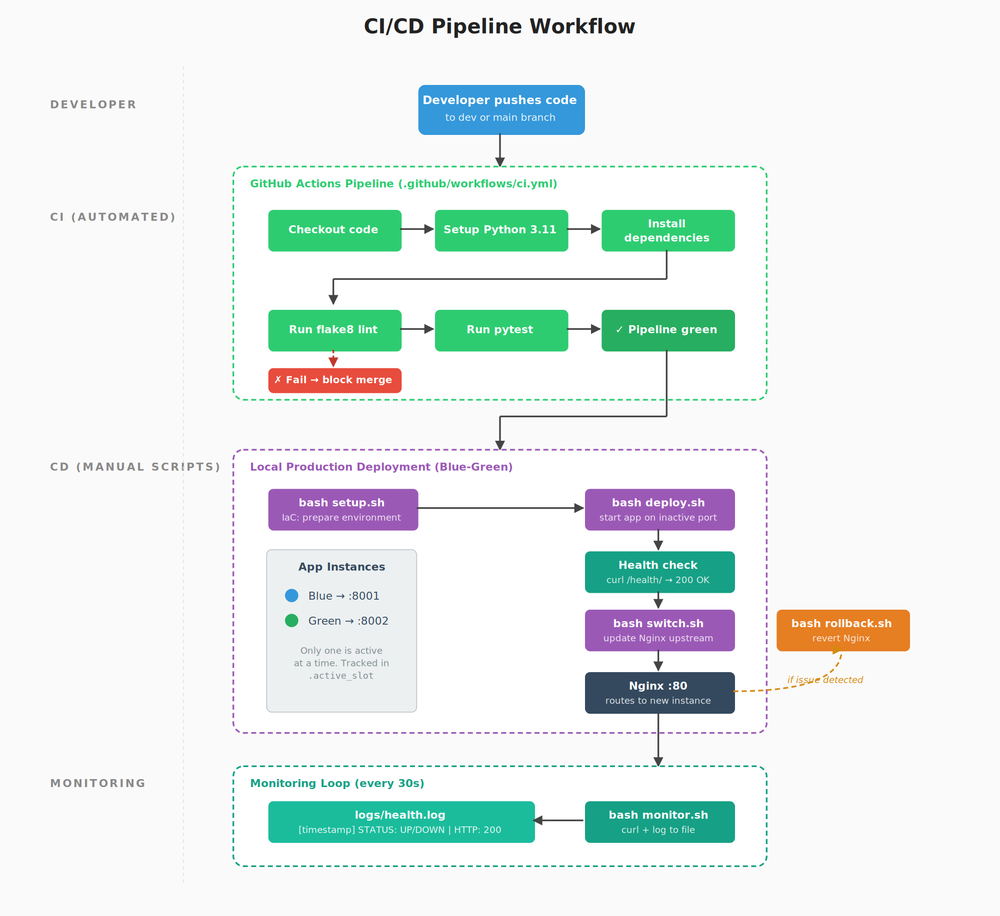

---

## Project Structure

```
devops-midterm-task-planning/
├── manage.py
├── requirements.txt
├── setup.sh              # IaC environment setup automation
├── deploy.sh             # Blue-green deployment
├── switch.sh             # Switch nginx traffic
├── rollback.sh           # Rollback to previous version
├── monitor.sh            # Monitoring periodic health checks
├── nginx.conf            # Nginx reverse proxy config
├── .active_slot          # Tracks currently active port
├── .github/workflows/
│   └── ci.yml            # GitHub Actions pipeline
├── logs/                 # Health and app logs
├── taskmanager_project/  # Django project settings
└── tasks/                # Django app (views, store, templates, tests)
```

---

## Prerequisites

- Ubuntu Linux (or WSL2 on Windows)
- Python 3.10+
- Nginx
- Git
- A user with sudo privileges

Install all system dependencies with:

```bash
sudo apt update
sudo apt install -y python3 python3-venv python3-pip nginx git
```

---

## Setup Instructions

### Step 1: Clone the repository

```bash
git clone <https://github.com/TemoDev/devops-midterm-task-planning>
cd devops-midterm-task-planning
```

### Step 2: Run automated environment setup

```bash
bash setup.sh
```

This script creates a Python virtual environment in `venv/`, upgrades pip, and installs all project dependencies from `requirements.txt` in one command.

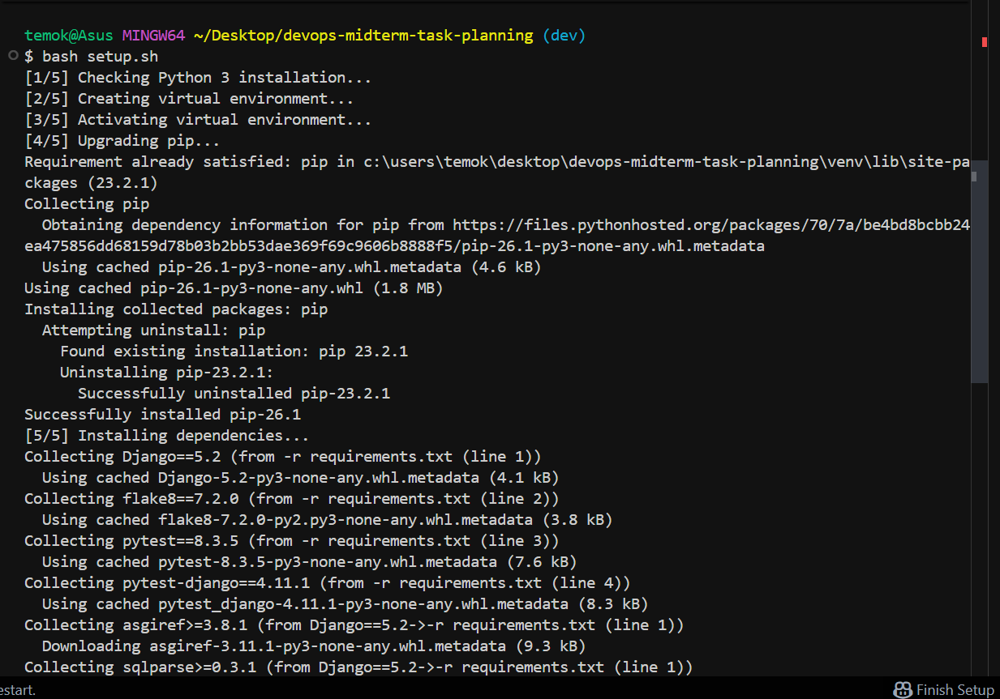
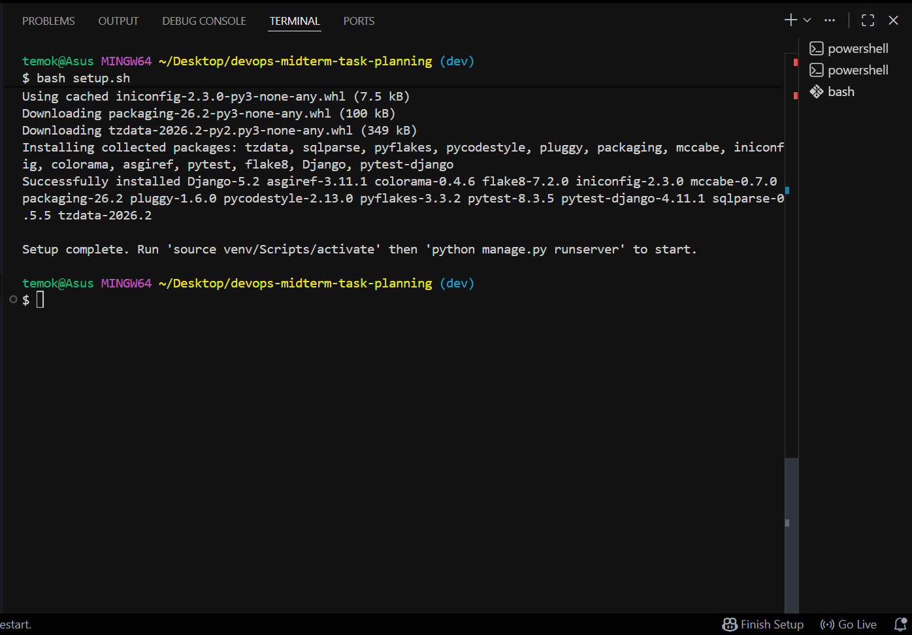

### Step 3: Start Nginx

```bash
sudo systemctl start nginx
```

---

## Running Tests Locally

Activate the virtual environment, then run pytest and flake8:

```bash
source venv/bin/activate
pytest
flake8 .
```

All 4 tests should pass and flake8 should report zero errors.

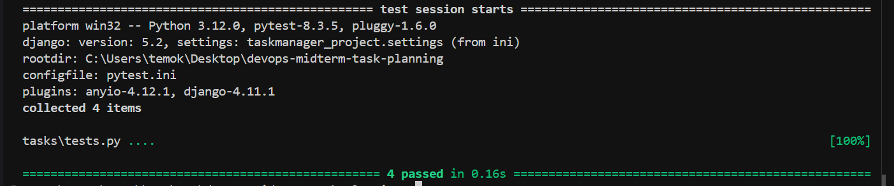

---

## CI Pipeline

The GitHub Actions workflow at `.github/workflows/ci.yml` runs automatically on every push and pull request targeting `main` or `dev`. It:

1. Checks out the code on a fresh `ubuntu-latest` runner
2. Sets up Python 3.11
3. Restores cached pip dependencies which is keyed on `requirements.txt`
4. Installs dependencies from `requirements.txt`
5. Runs `flake8 .` the job fails immediately if linting errors are found
6. Runs `pytest` all tests must pass for the pipeline to go green

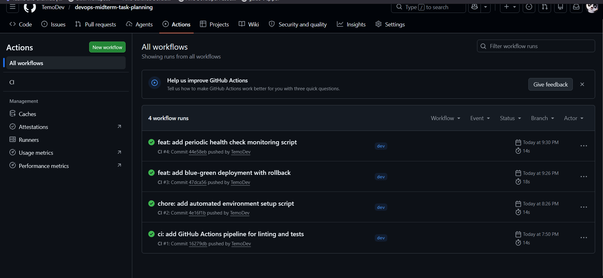

---

## Blue-Green Deployment

The project uses a blue-green deployment strategy. Two application slots run in parallel:

- **Blue** - Django instance on port 8001
- **Green** - Django instance on port 8002

Nginx listens on port 80 and forwards all traffic to whichever slot is currently active. When deploying a new version, the app starts on the inactive slot first and is health-checked before any traffic is switched over. The active slot is tracked in the `.active_slot` file.

### Deploy a new version

```bash
bash deploy.sh
```

Starts Django on the inactive port, waits for it to respond, and runs up to 10 health check attempts against `/health/`. Prints `Deploy successful` on pass or tails the log and exits with code `1` on failure.

Successful deploy:
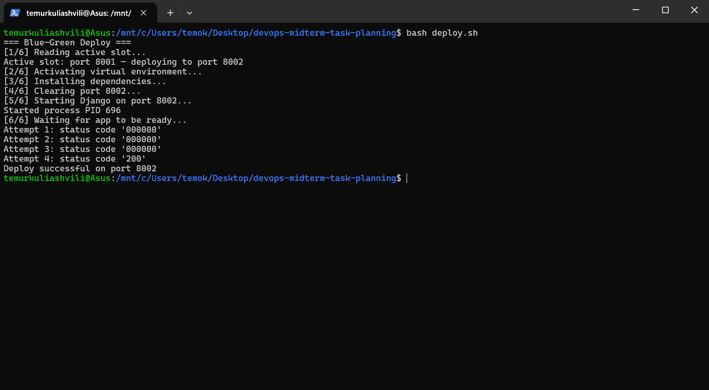

Unsuccessful deploy: 
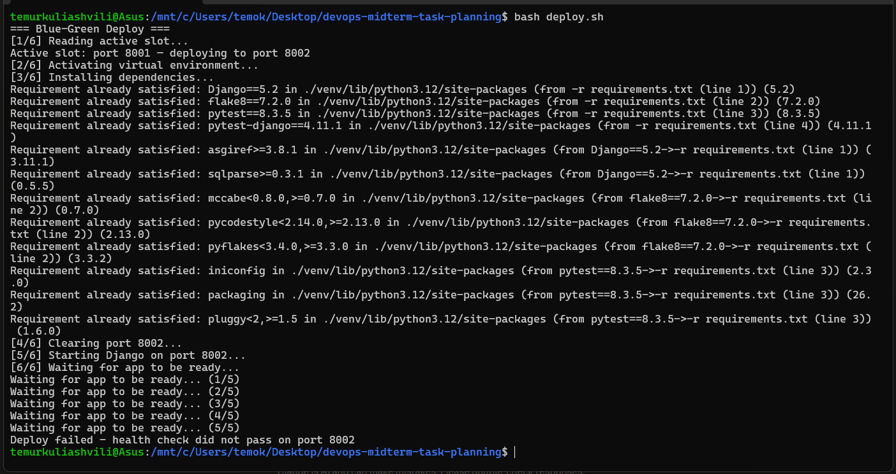


### Switch traffic to new version

```bash
bash switch.sh
```

Updates the upstream block in `nginx.conf` with `sed`, copies the config to `/etc/nginx/sites-available/taskmanager`, creates the `sites-enabled` symlink, removes the default Nginx site to avoid conflicts(this happened to me so I removed this), then runs `nginx -t` and `systemctl reload nginx`. Writes the new port to `.active_slot`.

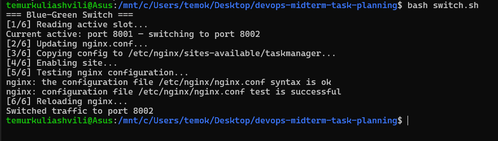

### Verify the running application

```bash
curl http://localhost/health/
```

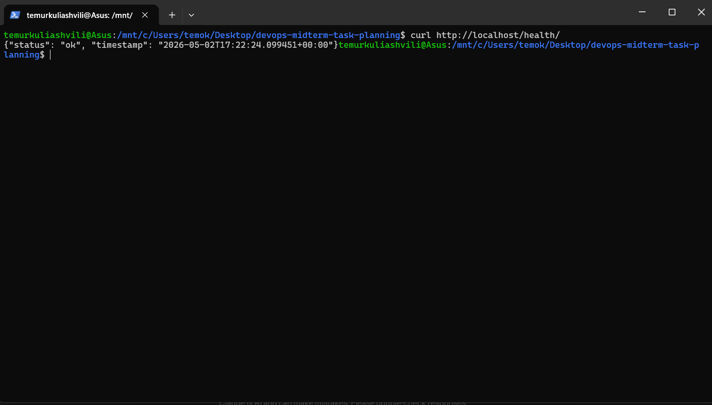

---

## Rollback

If the new deployment causes issues, rollback immediately flips Nginx back to the previous slot, no rebuild required, since the old instance is still running.

```bash
bash rollback.sh
```

The script first confirms the previous slot is healthy via a curl health check. If it is, it updates `nginx.conf`, reloads Nginx, and writes the previous port back to `.active_slot`. If the previous slot is not responding, it exits with an error rather than switching to a broken instance.

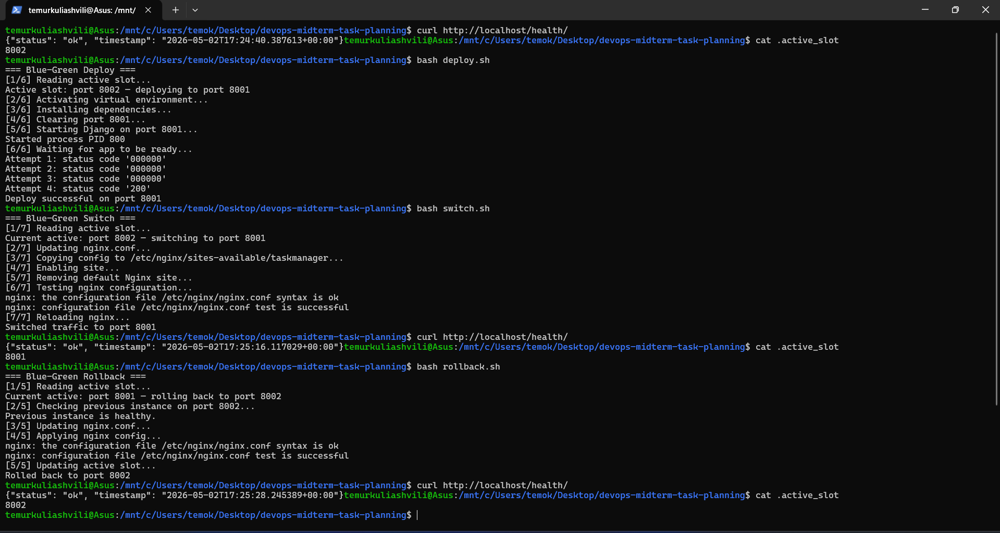

---

## Monitoring & Health Check

`monitor.sh` runs an infinite loop that hits the `/health/` endpoint every 30 seconds via the Nginx reverse proxy and writes a timestamped status line to `logs/health.log`.

```bash
bash monitor.sh
```

To inspect the log:

```bash
cat logs/health.log
```

Expected output format:

```
[2026-05-02 14:30:15] STATUS: UP | HTTP: 200 | Response: {"status": "ok", "timestamp": "..."}
[2026-05-02 14:30:45] STATUS: UP | HTTP: 200 | Response: {"status": "ok", "timestamp": "..."}
[2026-05-02 14:31:15] STATUS: DOWN | HTTP: 000 | Response: no response
```

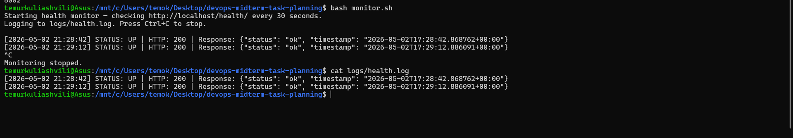

---

## Application Routes Reference

| Method | Route | Description |
|--------|-------|-------------|
| `GET` | `/` | Homepage — task list and create form |
| `GET` | `/task/<id>/` | Task detail page |
| `POST` | `/task/create/` | Create a new task |
| `GET` | `/health/` | Health check endpoint — returns JSON |

---

## Git Branching Strategy

| Branch | Purpose |
|--------|---------|
| `main` | Production-ready code |
| `dev` | Active development |

All changes are developed on `dev` and merged into `main` via pull request once CI passes.

## Full demo deployment flow

### Initial deployment
From scratch, first we deploy initial application version and switch traffic to that port: 

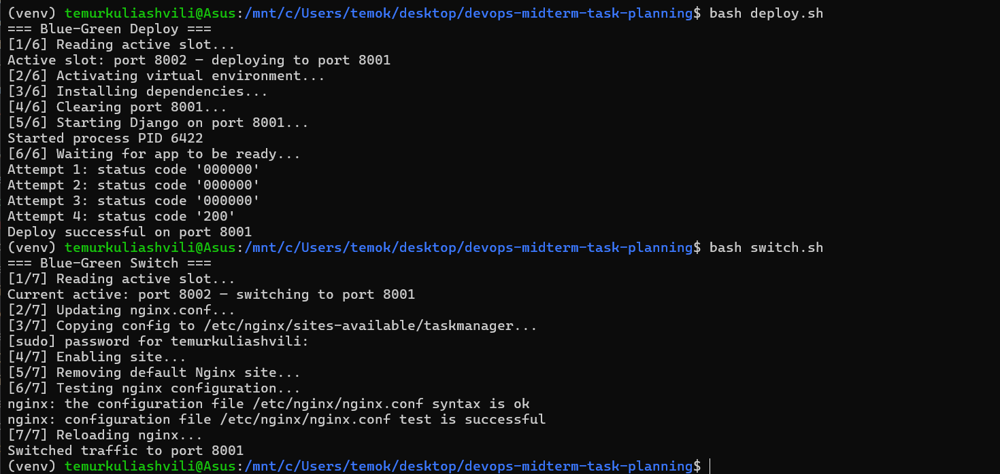
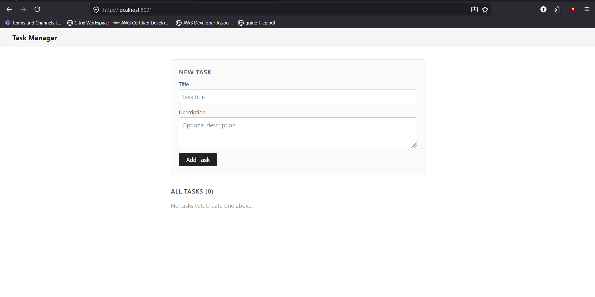
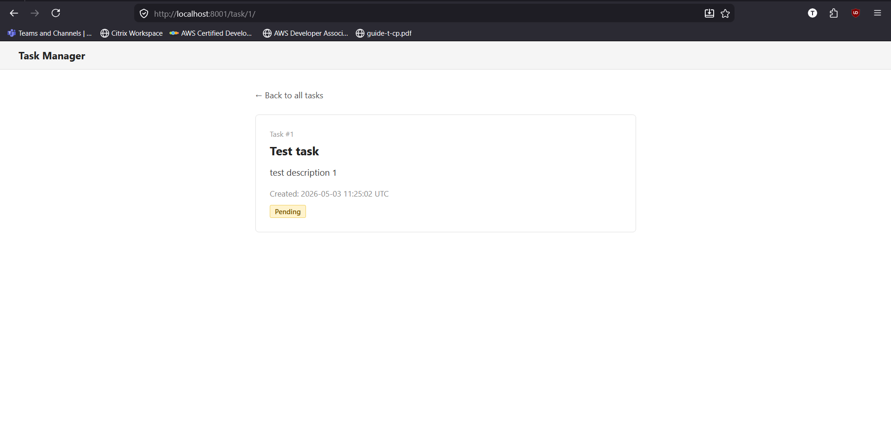

In second WSL terminal let's monitor health: 
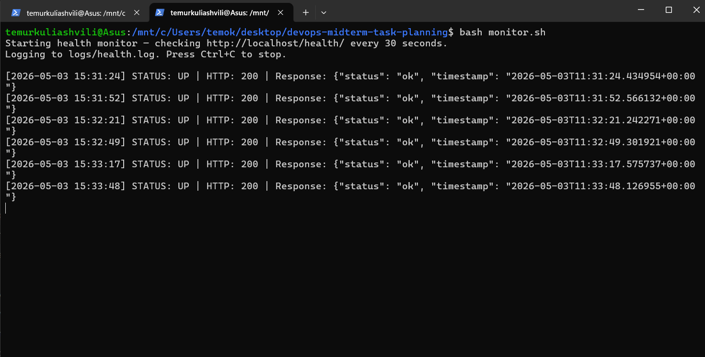

### Deployment of new version

I made this small change to the UI, just for it to be visible:
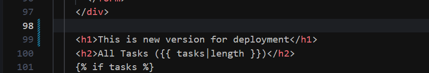

Now let's deploy this changes: 
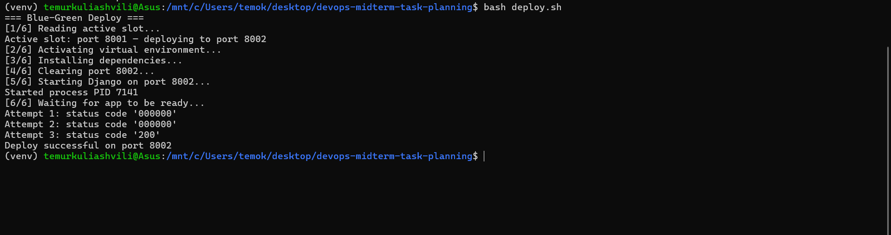

Now we can check if both instances are running:
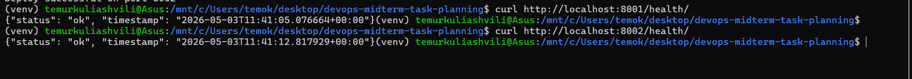
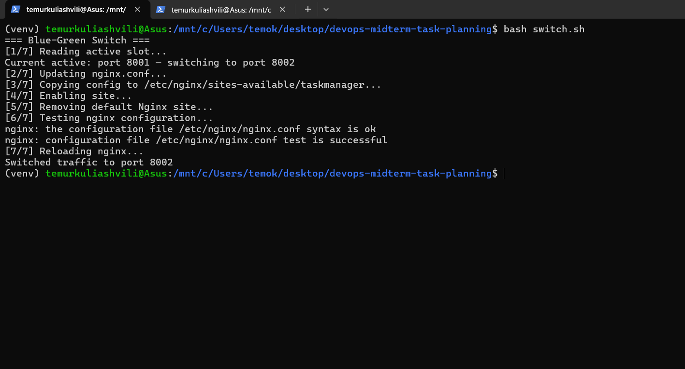

---

We can check with UI that both instances are running as well:
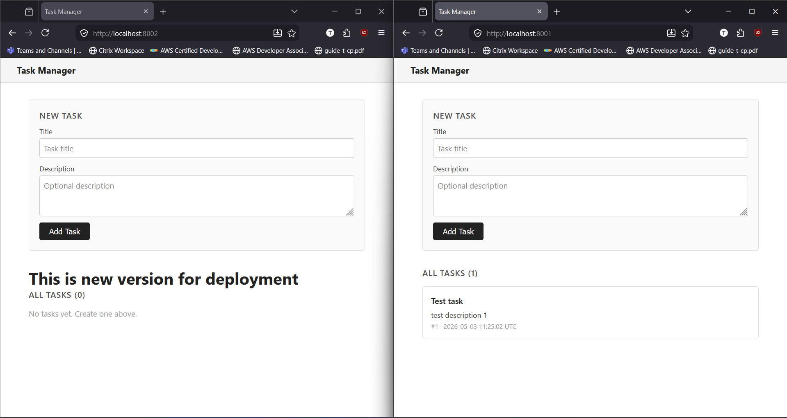
And default traffic goes to localhost(on port 8002):
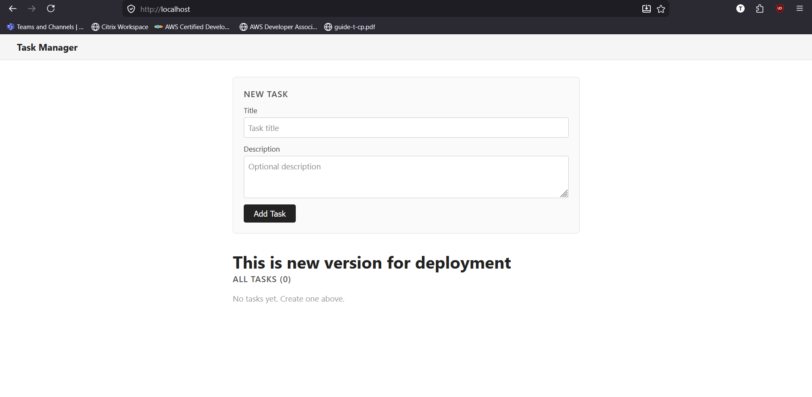

---

We can also test rollback:
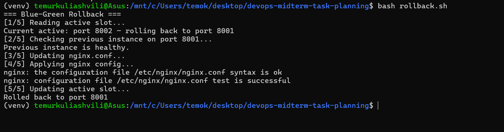
Here below we can see that traffic is back to 8001 port on default localhost:
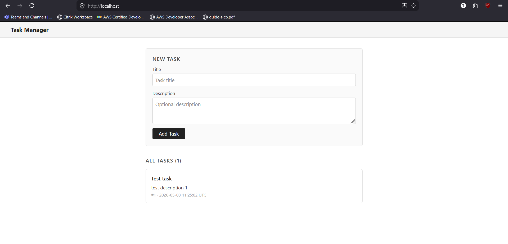


